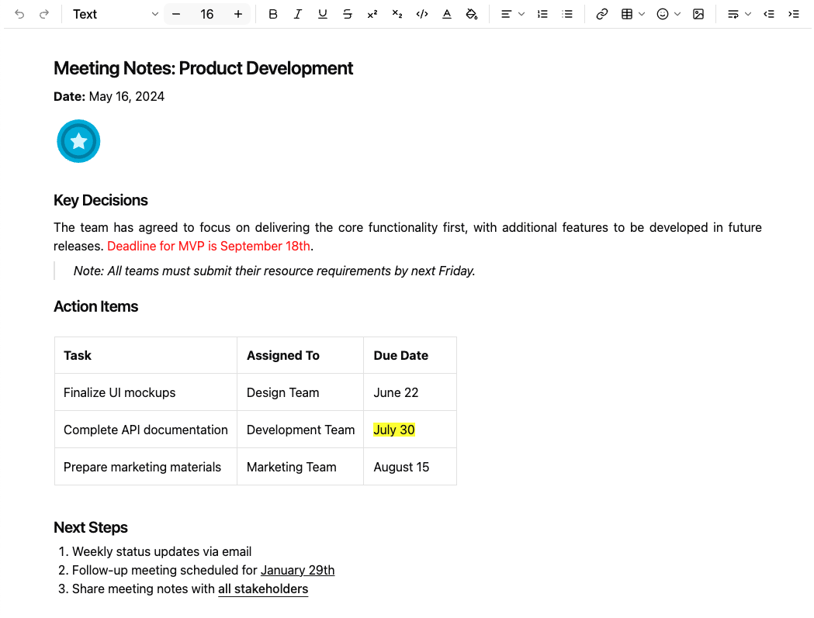

# Overview

Keikaidoc PE is a lightweight rich text editor component.
It provides essential text editing capabilities and HTML content manipulation.
This component enables developers to efficiently implement rich text editing functionality in their web applications,
with comprehensive support for text formatting, tables, lists, and other standard editing features.

# Quick Start

## Setup for Maven
To use Keikaidoc PE, add the `keikai-doc-lite` dependency to your `pom.xml` file:

``` xml
<dependency>
    <groupId>io.keikai</groupId>
    <artifactId>keikai-doc-lite</artifactId>
    <version>${keikaidoc.version}</version>
</dependency>
```

## Create a Keikaidoc PE Page
Create a new `zul` file in your `webapp` directory with the following content:

``` xml
<zk>
    <docpadlite />
</zk>
```

Then you'll see an editor displayed on your web page.

## Setting Initial HTML Content
You can initialize the editor with HTML content by using the following approach:

``` xml
<docpadlite>
    <attribute name="value"><![CDATA[
        <h2>Meeting Notes: Product Development</h2>
        <p><b>Date:</b> May 16, 2024</p>
        
        <h3>Key Decisions</h3>
        <p style="text-align:justify">The team has agreed to focus on delivering the core functionality first, with additional features to be developed in future releases. <span style="color:red">Deadline for MVP is September 18th</span>.</p>
        <blockquote>Note: All teams must submit their resource requirements by next Friday.</blockquote>
        <h3>Action Items</h3>
        <table border="1" style="width:100%">
            <tr>
                <th>Task</th>
                <th>Assigned To</th>
                <th>Due Date</th>
            </tr>
            <tr>
                <td>Finalize UI mockups</td>
                <td>Design Team</td>
                <td>June 22</td>
            </tr>
            <tr>
                <td>Complete API documentation</td>
                <td>Development Team</td>
                <td><span style="background-color:yellow">July 30</span></td>
            </tr>
            <tr>
                <td>Prepare marketing materials</td>
                <td>Marketing Team</td>
                <td>August 15</td>
            </tr>
        </table>
        <h3>Next Steps</h3>
        <ol>
            <li>Weekly status updates via email</li>
            <li>Follow-up meeting scheduled for <u>January 29th</u></li>
            <li>Share meeting notes with <a href="mailto:stakeholders@example.com">all stakeholders</a></li>
        </ol>
    ]]></attribute>
</docpadlite>
```
here's the result



### Supported HTML Tags

The following HTML tags are supported by Keikaidoc PE:

| HTML Tag                               | Description |
|----------------------------------------|-------------|
| `<h1>` `<h2>` `<h3>` `<h4>` `<h5>` `<h6>` | Headings from level 1 (largest) to level 6 (smallest) |
| `<p>`                                  | Paragraph of text |
| `<p style="text-align:left">`          | Left-aligned paragraph (default) |
| `<p style="text-align:center">`        | Center-aligned paragraph |
| `<p style="text-align:right">`         | Right-aligned paragraph |
| `<p style="text-align:justify">`       | Justified paragraph (even spacing across lines) |
| `<blockquote>`                         | Indented block of text, typically used for quotations |
| `<b>` `<strong>`                       | Bold text |
| `<u>`                                  | Underlined text |
| `<s>`                                  | Strikethrough text |
| `<sup>`                                | Superscript text |
| `<sub>`                                | Subscript text |
| `<code>`                               | Code snippet (typically displayed in monospace font) |
| `<span style="color:${COLOR}">`        | Text with specified color |
| `<span style="background-color:${COLOR}">` | Text with specified background color |
| `<span style="font-size:${FONT_SIZE}px">` | Text with specified font size |
| `<table>`                              | Table for displaying data in rows and columns |
| `<tr>`                                 | Table row |
| `<th>`                                 | Table header cell |
| `<td>`                                 | Table data cell |
| `<ul>`                                 | Unordered (bulleted) list |
| `<ol>`                                 | Ordered (numbered) list |
| `<li>`                                 | List item (used within ul or ol) |
| `<a href="...">`                       | Hyperlink to specified URL |
| ``                      | Image with specified source URL |

## Setting Custom Configurations
Keikaidoc PE offers extensive configuration options to tailor the editor to your specific requirements. You can customize the component by specifying a JSON configuration file using the `customConfigurationsPath` attribute, this attribute points to a JSON file located at the webapp root where you can define your custom settings.
``` xml
<docpadlite customConfigurationsPath="/config.json"/>
```
Single-Line Toolbar:
``` json
{
    "toolbar": [["Undo", "Redo", "-", "Bold", "Italic", "Underline", "Strike", "Subscript", "Superscript"]]
}
```


Multi-Lines Toolbar:
``` json
{
    "toolbar": [
        ["Bold", "Italic", "Underline", "Strike", "Subscript", "Superscript"],
        ["FontSize", "FontColor", "FontBackgroundColor"],
        ["NumberedList", "BulletedList", "Outdent", "Indent"],
        ["Link"],
        ["Image", "Table", "HorizontalRule"],
        ["Undo", "Redo"]
    ]
}
```


If you do not specify a custom configuration, the default toolbar will include all available editing tools:


### Toolbar Functions
Keikaidoc PE supports the following toolbar functions:

| Toolbar Button Key  | Description                       |
|---------------------|-----------------------------------|
| `Undo`                | Undo the last operation           |
| `Redo`                | Redo the next operation           |
| `TurnInto`            | Convert text to a specific format |
| `FontSize`            | Change font size                  |
| `Bold`                | Bold text                         |
| `Italic`              | Italic text                       |
| `Underline`           | Underline text                    |
| `Strike`              | Strikethrough text                |
| `Superscript`         | Superscript text                  |
| `Subscript`           | Subscript text                    |
| `Code`                | Code format                       |
| `FontColor`           | Font color                        |
| `FontBackgroundColor` | Font background color             |
| `HorizontalRule`      | Horizontal alignment              |
| `NumberedList`        | Numbered list                     |
| `BulletedList`        | Bulleted list                     |
| `Link`                | Insert link                       |
| `Table`               | Insert table                      |
| `Emoji`               | Insert emoji                      |
| `Image`               | Insert image                      |
| `LineHeight`          | Adjust line height                |
| `Outdent`             | Decrease indent                   |
| `Indent`              | Increase indent                   |
| `-`                   | Separator                         |

# Supported Events

Keikaidoc PE emits the following events that you can listen for in your application:

| Event Name  | Event Type                                                                                                                                                                                                                                                                                                                                                                              |
|-------------|----------------------------------------------------------------------------------------------------------------------------------------------------------------------------------------------------------------------------------------------------------------------------------------------------------------------------------------------------------------------------------------|
| `onChange`  | [InputEvent](http://www.zkoss.org/javadoc/latest/zk/org/zkoss/zk/ui/event/InputEvent.html)<br/>**Description:** Triggered when the editor content has been modified and completed by the user.                                                                                                                                                                                          |
| `onChanging` | [InputEvent](http://www.zkoss.org/javadoc/latest/zk/org/zkoss/zk/ui/event/InputEvent.html)<br/>**Description:** Triggered during the process of content modification. Note that the component's server-side content remains unchanged until the `onChange` event occurs. To access the current in-progress value, use the `getValue` method of the `InputEvent` class. |

# Supported Children
Keikaidoc PE does not support child components.