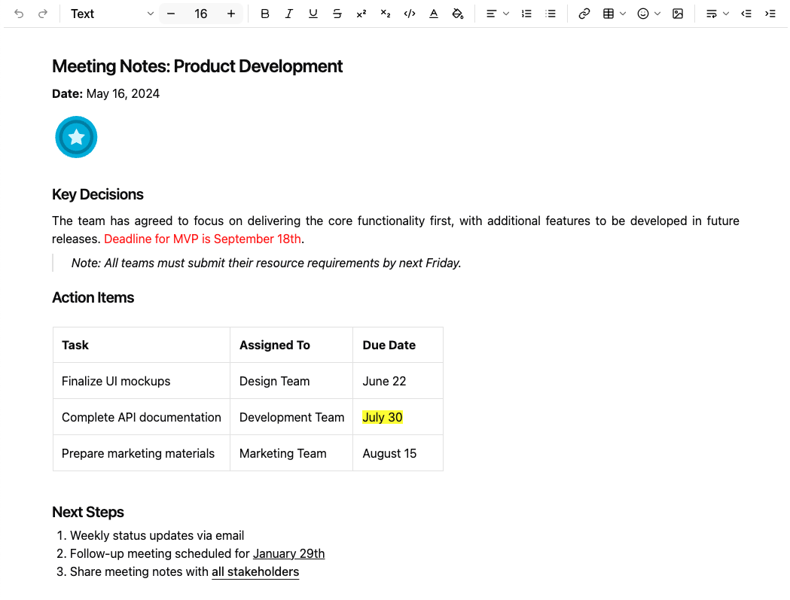
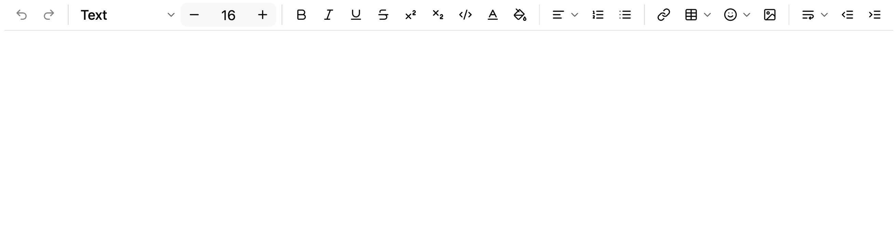
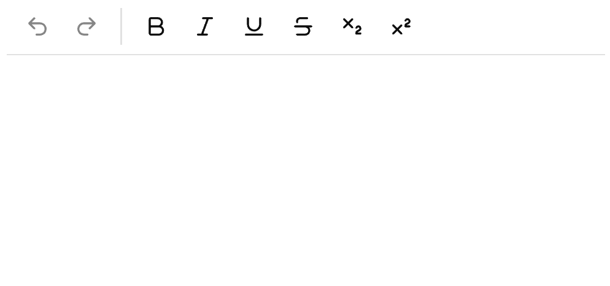
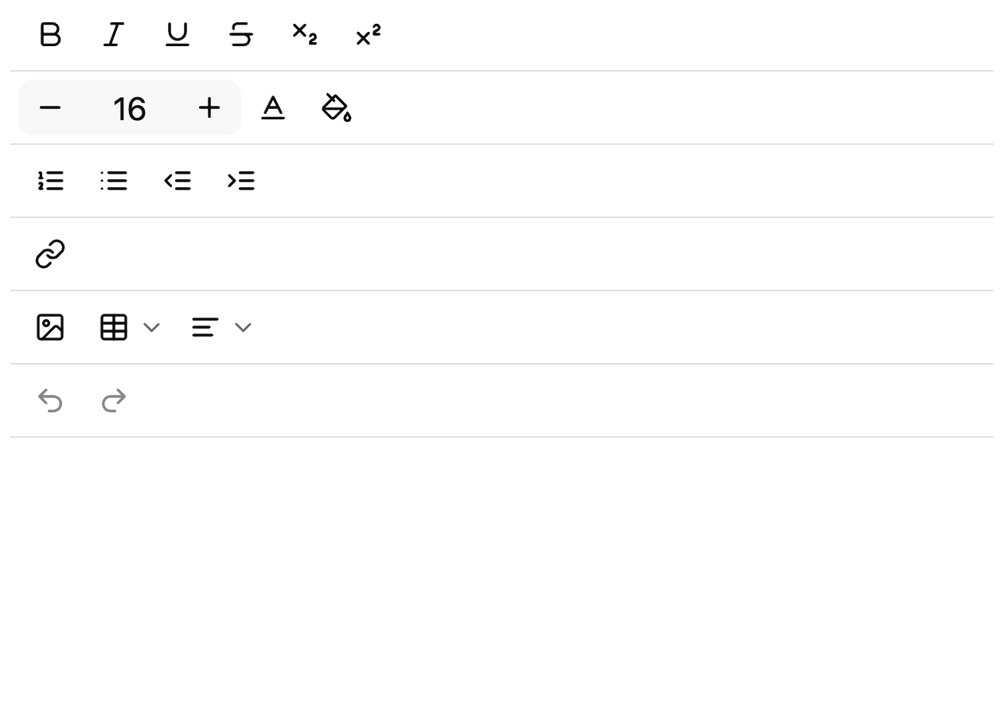

# Overview

Keikai Doc PE is a lightweight rich text editor component.
It provides essential text editing capabilities and HTML content manipulation.
This component enables developers to efficiently implement rich text editing functionality in their web applications,
with comprehensive support for text formatting, tables, lists, and other standard editing features.

# Quick Start

## Setup for Maven

Add the repository:

```xml
<repository>
    <id>Keikai EVAL</id>
    <name>Keikai Evaluation Repository</name>
    <url>https://mavensync.zkoss.org/eval</url>
</repository>
```

To begin using Keikai Doc PE in your project, include the `keikai-doc` dependency in your `pom.xml` file:

``` xml
<dependency>
    <groupId>io.keikai</groupId>
    <artifactId>keikai-doc</artifactId>
    <version>1.0.0.FL.202504181625-Eval</version>
</dependency>
```

Check [Maven repository](https://mavensync.zkoss.org/eval/io/keikai/keikai-doc/) for the latest version. 

## Create Your First Editor
To create a simple editor page, add a new `zul` file in your web app context root with the following content:

``` xml
<zk>
    <document/>
</zk>
```

Then visit you'll see an editor displayed on your web page.

# Setting Values
Keikai Doc PE provides multiple ways to set content in the editor.
The component supports the `value` attribute,
which allows you to specify HTML content in several different ways.

## 1. Simple Text via ZUL
For basic text content, you can set the value directly in the ZUL file:

``` xml
<zk>
    <document value="Hello Keikaidoc" />
</zk>
```

## 2. Programmatic Setting via Java
For dynamic content or when you need to set values from your controller:

``` java
public class MyComposer extends SelectorComposer<Component> {

	@Wire("document")
	private Document document;

	@Override
	public void doAfterCompose(Component comp) throws Exception {
		super.doAfterCompose(comp);
		document.setValue("Hello Keikaidoc");
	}
}
```

## 3. Complex HTML Content
For rich content with formatting, tables, and other HTML elements, use the `attribute` tag with a CDATA section:

``` xml
<zk>
    <document>
        <attribute name="value"><![CDATA[
            <h2>Meeting Notes: Product Development</h2>
            <p><b>Date:</b> May 16, 2024</p>
            
            <h3>Key Decisions</h3>
            <p style="text-align:justify">The team has agreed to focus on delivering the core functionality first, with additional features to be developed in future releases. <span style="color:red">Deadline for MVP is September 18th</span>.</p>
            <blockquote>Note: All teams must submit their resource requirements by next Friday.</blockquote>
            <h3>Action Items</h3>
            <table border="1" style="width:100%">
                <tr>
                    <th>Task</th>
                    <th>Assigned To</th>
                    <th>Due Date</th>
                </tr>
                <tr>
                    <td>Finalize UI mockups</td>
                    <td>Design Team</td>
                    <td>June 22</td>
                </tr>
                <tr>
                    <td>Complete API documentation</td>
                    <td>Development Team</td>
                    <td><span style="background-color:yellow">July 30</span></td>
                </tr>
                <tr>
                    <td>Prepare marketing materials</td>
                    <td>Marketing Team</td>
                    <td>August 15</td>
                </tr>
            </table>
            <h3>Next Steps</h3>
            <ol>
                <li>Weekly status updates via email</li>
                <li>Follow-up meeting scheduled for <u>January 29th</u></li>
                <li>Share meeting notes with <a href="mailto:stakeholders@example.com">all stakeholders</a></li>
            </ol>
        ]]></attribute>
    </document>
</zk>
```
The result will look like this, with proper formatting and styling applied:





## Supported HTML Tags
Keikai Doc PE supports a comprehensive set of HTML tags for content formatting. The table below outlines all supported tags and their respective functions:

| HTML Tag                               | Description |
|----------------------------------------|-------------|
| `<h1>` `<h2>` `<h3>` `<h4>` `<h5>` `<h6>` | Headings from level 1 (largest) to level 6 (smallest) |
| `<p>`                                  | Paragraph of text |
| `<p style="text-align:left">`          | Left-aligned paragraph (default) |
| `<p style="text-align:center">`        | Center-aligned paragraph |
| `<p style="text-align:right">`         | Right-aligned paragraph |
| `<p style="text-align:justify">`       | Justified paragraph (even spacing across lines) |
| `<blockquote>`                         | Indented block of text, typically used for quotations |
| `<b>` `<strong>`                       | Bold text |
| `<u>`                                  | Underlined text |
| `<s>`                                  | Strikethrough text |
| `<sup>`                                | Superscript text |
| `<sub>`                                | Subscript text |
| `<code>`                               | Code snippet (typically displayed in monospace font) |
| `<span style="color:${COLOR}">`        | Text with specified color |
| `<span style="background-color:${COLOR}">` | Text with specified background color |
| `<span style="font-size:${FONT_SIZE}px">` | Text with specified font size |
| `<table>`                              | Table for displaying data in rows and columns |
| `<tr>`                                 | Table row |
| `<th>`                                 | Table header cell |
| `<td>`                                 | Table data cell |
| `<ul>`                                 | Unordered (bulleted) list |
| `<ol>`                                 | Ordered (numbered) list |
| `<li>`                                 | List item (used within ul or ol) |
| `<a href="...">`                       | Hyperlink to specified URL |
| ``                      | Image with specified source URL |


# Getting Values

`getValue()` returns users-entered content in the HTML values. 

```java
public class MyComposer extends SelectorComposer<Component> {

    @Wire("document")
    private Document document;
    ...
    String htmlContent = document.getValue();
    ...
}
```

# Setting Custom Configurations
Keikai Doc PE offers extensive configuration options to tailor the editor to your specific requirements. You can customize the component by specifying a JSON configuration file using the `customConfigurationsPath` attribute, this attribute points to a JSON file located at the webapp root where you can define your custom settings.

Keikai Doc PE provides flexible configuration options that allow you to tailor the editor's interface and functionality to meet your specific requirements. You can customize the editor by specifying a JSON configuration file using the `customConfigurationsPath` attribute:

``` xml
<document customConfigurationsPath="/config.json"/>
```

This attribute references a JSON file located at your webapp root directory where you can define your preferred settings.


## Toolbar Configuration 
You can configure the toolbar's buttons by specifying button key in a JSON file. See [All Available Toolbar Functions](#all-available-toolbar-functions).

Here are some configuration examples:

### 1. Default Configuration
If you don't specify a custom configuration, the editor will display all available buttons in the default layout:



### 2. Single-Line Compact Toolbar
For a minimalist interface with essential editing tools:

``` json
{
    "toolbar": [["Undo", "Redo", "-", "Bold", "Italic", "Underline", "Strike", "Subscript", "Superscript"]]
}
```



### 3. Multi-Line Organized Toolbar
For a more comprehensive editing experience with tools grouped by function:

``` json
{
    "toolbar": [
        ["Bold", "Italic", "Underline", "Strike", "Subscript", "Superscript"],
        ["FontSize", "FontColor", "FontBackgroundColor"],
        ["NumberedList", "BulletedList", "Outdent", "Indent"],
        ["Link"],
        ["Image", "Table", "HorizontalRule"],
        ["Undo", "Redo"]
    ]
}
```



### 4. Hide Toolbar
If you don't want to display the toolbar, you can configure it as follows：

``` json
{
    "toolbar": []
}
```

# Toolbar Functions
Keikai Doc PE supports the following toolbar functions:

## All Available Toolbar Functions
The following table lists all toolbar functions available for configuration in Keikai Doc PE:

| Toolbar Button Key  | Description                       |
|---------------------|-----------------------------------|
| `Undo`                | Undo the last operation           |
| `Redo`                | Redo the next operation           |
| `TurnInto`            | Convert text to a specific format |
| `FontSize`            | Change font size                  |
| `Bold`                | Bold text                         |
| `Italic`              | Italic text                       |
| `Underline`           | Underline text                    |
| `Strike`              | Strikethrough text                |
| `Superscript`         | Superscript text                  |
| `Subscript`           | Subscript text                    |
| `Code`                | Code format                       |
| `FontColor`           | Font color                        |
| `FontBackgroundColor` | Font background color             |
| `HorizontalRule`      | Horizontal alignment              |
| `NumberedList`        | Numbered list                     |
| `BulletedList`        | Bulleted list                     |
| `Link`                | Insert link                       |
| `Table`               | Insert table                      |
| `Emoji`               | Insert emoji                      |
| `Image`               | Insert image                      |
| `LineHeight`          | Adjust line height                |
| `Outdent`             | Decrease indent                   |
| `Indent`              | Increase indent                   |
| `-`                   | Vertical Separator                |

## Limitation
Make sure your Windows (OS) uses Segoe UI version 1.32 or above — older versions might not show all emojis properly.

# Supported Events
Keikai Doc PE emits the following events that allow your application to respond to user interactions. You can listen to these events to implement custom behaviors or application logic.

| Event Name  | Event Type                                                                                                                                                                                                                                                                                                                                                                              |
|-------------|----------------------------------------------------------------------------------------------------------------------------------------------------------------------------------------------------------------------------------------------------------------------------------------------------------------------------------------------------------------------------------------|
| `onChange`  | [InputEvent](http://www.zkoss.org/javadoc/latest/zk/org/zkoss/zk/ui/event/InputEvent.html)<br/>**Description:** Triggered when the editor content has been modified and completed by the user.                                                                                                                                                                                          |
| `onChanging` | [InputEvent](http://www.zkoss.org/javadoc/latest/zk/org/zkoss/zk/ui/event/InputEvent.html)<br/>**Description:** Triggered during the process of content modification. Note that the component's server-side content remains unchanged until the `onChange` event occurs. To access the current in-progress value, use the `getValue` method of the `InputEvent` class. |

# Supported Children
Keikai Doc PE does not support child components.

# Component Composition
Keikai Doc PE is designed as a self-contained editor component and does not support nested child components.
